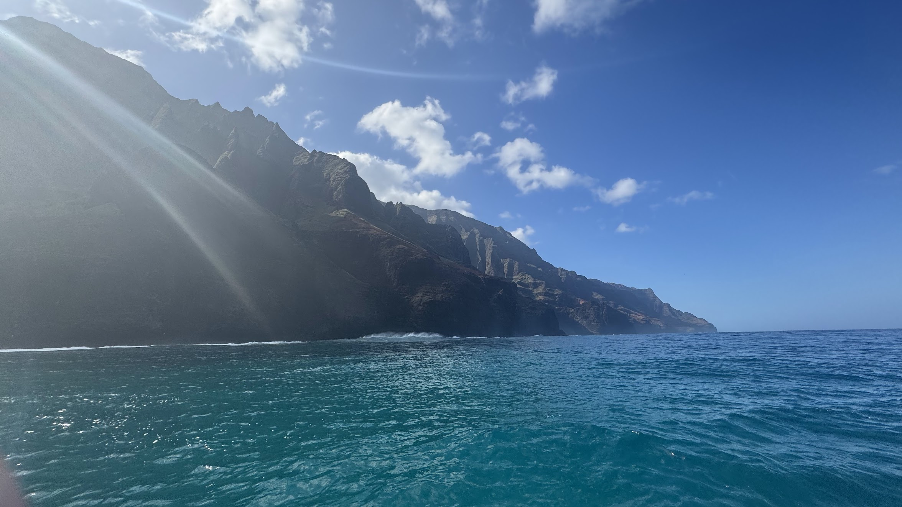
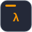
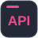
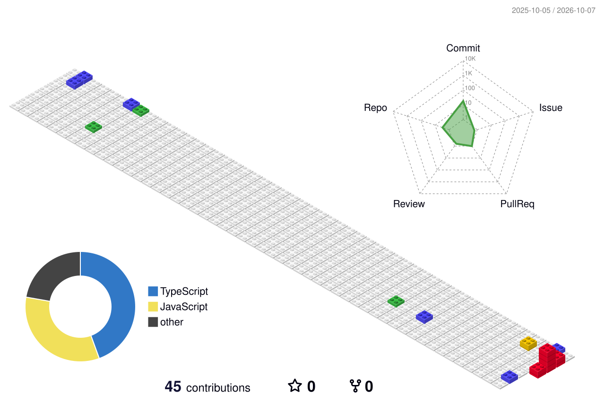

<h1 align="center">Sebastian De La Cruz</h1>

<strong>Software Engineering · AI · Cloud · Cybersecurity</strong>

I’m a Systems Engineering student at the University of Lima. I build web and backend applications, explore applied AI, and work with AWS and OCI to bring software into the cloud. DevOps and security are part of how I approach that work.

## Technologies

<strong>Frontend</strong>

  

<strong>Backend & languages</strong>

  

<strong>Databases</strong>

  
  

<strong>AI & data</strong>

  
  
  
  
  
  

<strong>Cloud & DevOps</strong>

  
  
  

<strong>AWS services</strong>

  
  
  
  
  
  
  

<strong>Security</strong>

  
  
  
  
  
  

## Selected project

**[Dental Screening](https://github.com/polux2004/dental-screening-app)** — A prototype for exploring visual signs of caries in dental photos through a React interface and a FastAPI inference service. 
`React` · `FastAPI` · `OpenCV` · `PyTorch`

## 3D contributions

<!-- The workflow replaces this temporary SVG with the real contribution graph on its first run. -->

  

## Certifications

- AWS Certified AI Practitioner
- Junior Penetration Tester (eJPT)
- Oracle Cloud Infrastructure Foundations
- Ethical Hacking Essentials — EC-Council

## Contact

  
  
  
  
  

