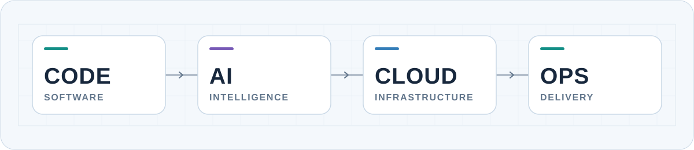

<picture>
  <source media="(prefers-color-scheme: dark)" srcset="./assets/focus-dark.svg">
  <source media="(prefers-color-scheme: light)" srcset="./assets/focus-light.svg">
  
</picture>

# Sebastian De la Cruz

**Software developer · AI development · Cloud & DevOps**

I’m a 10th-semester Systems Engineering student at the University of Lima. I build web and backend applications, and I’m interested in integrating AI and deploying reliable systems on AWS and OCI.

[LinkedIn](https://www.linkedin.com/in/sebastian-de-la-cruz-88aa0a273/) · [GitHub](https://github.com/polux2004)

## Selected work

**[Dental Screening](https://github.com/polux2004/dental-screening-app)** — A prototype for exploring visual signs of caries in dental photos through a React interface and a FastAPI inference service. 
`React` · `FastAPI` · `OpenCV` · `PyTorch`

## Toolkit

- **Build:** Python, TypeScript, React, Next.js, FastAPI, Django, Node.js
- **Intelligence:** PyTorch, TensorFlow, scikit-learn, Hugging Face, OpenCV, LLM APIs
- **Run:** AWS, Oracle Cloud Infrastructure, Docker, GitHub Actions, Linux, Nginx
- **Secure:** Burp Suite, Nmap, SonarQube, ZAP, Trivy

Explore the full stack

- **Frontend:** HTML, CSS, JavaScript, TypeScript, React, Angular, Next.js, Tailwind CSS
- **Backend & languages:** Python, FastAPI, Flask, Django, Node.js, Java, PHP
- **Databases:** PostgreSQL, MySQL, SQL Server, MongoDB, Supabase
- **AI & data:** Pandas, NumPy, scikit-learn, PyTorch, TensorFlow, OpenCV, YOLO, Hugging Face, LLM / OpenAI APIs
- **Cloud & DevOps:** AWS (EC2, S3, Lambda, RDS, DynamoDB, API Gateway, IAM), Oracle Cloud Infrastructure, Git, GitHub, GitHub Actions, Docker, Docker Compose, Linux, Nginx
- **Security:** Burp Suite, Nmap, SonarQube, ZAP, Trivy, web and network penetration testing

## Credentials

AWS Certified AI Practitioner · Junior Penetration Tester (eJPT) · Oracle Cloud Infrastructure Foundations · Ethical Hacking Essentials (EC-Council)

---

**Currently exploring:** AI-powered applications, backend architecture, and cloud delivery.
